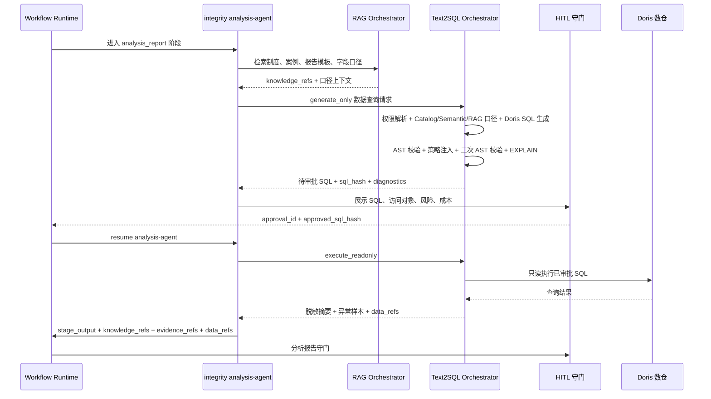

	# Text2SQL 共享 Agent 详细设计

> **所属系统**：赫尔墨斯（Hermes）风险控制 AI 智能体  
> **适用范围**：8 个业务模块全部 Stage Agent、对话入口 Agent、只读数仓查询接口  
> **依赖文档**：[00-agent-architecture.md](00-agent-architecture.md)、[10-rag-shared-agent.md](10-rag-shared-agent.md)、[../architecture-design.md](../architecture-design.md)、[../data-design.md](../data-design.md)、[../api-design.md](../api-design.md)  
> **设计定位**：共享 Agent 能力 / Text2SQL Orchestrator / Data Query Orchestrator  
> **文档版本**：v1.0  
> **最后更新**：2026-06-27

---

## 一、核心结论

各业务模块都存在“用自然语言查询数仓数据”的需求，例如风险规则生成、异常明细扫描、审计抽样、员工行为核验、供应商关联分析、整改证据核对等。该能力不应散落在各模块 Agent 中，也不应作为第 9 个业务模块独立推进流程，而应抽象为与 RAG Orchestrator 并列的共享能力，生产名称建议统一为 **Text2SQL Orchestrator**。

Text2SQL Orchestrator 的职责是：在模块、阶段、租户、组织、角色、密级和数据域权限范围内，将自然语言数据问题转换为受控 SQL，并完成 Schema/口径检索、语义层解析、SQL 生成、AST 安全校验、权限策略注入、成本评估、HITL 门禁、只读执行、结果脱敏、数据引用、审计记录和质量反馈。

生产数仓对接 **Apache Doris**。Text2SQL 生成、校验、改写、EXPLAIN 和执行均以 Doris/MySQL 兼容方言为主；开发或测试环境如使用其它数据库，只能作为降级适配，不能改变生产方言约束。

Text2SQL Orchestrator 不直接修改案件、不推进工作流、不生成业务终态、不绕过 HITL。所有业务阶段推进仍由 LangGraph Workflow Runtime 裁决；所有业务结论仍由 Stage Agent 输出结构化建议，并经规则校验和人工守门确认。

架构关系如下：

```text
Stage Agent / Conversation Gateway / Data Query API
  -> Text2SQL Orchestrator
  -> 权限与数据域解析
  -> Data Catalog + RAG 数据字典检索
  -> 查询计划生成
  -> SQL 生成
  -> SQL AST 安全校验
  -> 租户、组织、密级、字段脱敏策略注入
  -> EXPLAIN / 成本评估
  -> HITL 门禁
  -> 只读数仓执行
  -> 结果脱敏、摘要、数据引用
  -> diagnostics、trace、审计与反馈闭环
```

Text2SQL 与 RAG 的边界：

| 能力 | 主要对象 | 输出 | 是否查询数仓 |
|------|----------|------|--------------|
| RAG Orchestrator | 制度、案例、模板、报告、数据字典文档、字段口径说明 | 知识片段、上下文、知识引用 | 否 |
| Text2SQL Orchestrator | 结构化业务数据、数仓明细、指标聚合、异常样本 | SQL、结果摘要、数据引用 | 是，只读 |

---

## 二、职责边界

| 对象 | 负责什么 | 不负责什么 |
|------|----------|------------|
| Text2SQL Orchestrator | 自然语言数据问题理解、Schema/指标口径检索、SQL 生成、安全校验、只读执行、结果摘要、数据引用、诊断和审计 | 不推进 workflow，不写业务终态，不决定处罚、移交、关闭 |
| RAG Orchestrator | 检索数据字典文档、历史规则、制度、案例、模板和字段口径说明 | 不执行结构化数仓查询 |
| Stage Agent | 提出数据问题，消费查询结果，生成结构化业务建议 | 不直接拼接 SQL，不直接连接数仓，不绕过审批执行 SQL |
| Module Graph | 阶段路由、HITL、重试、恢复、人工接管、事件触发 | 不做自由文本推理，不承载 SQL 生成逻辑 |
| Data Catalog | 表、字段、主外键、指标、数据等级、负责人、生命周期 | 不生成业务结论 |
| Warehouse Adapter | 连接数仓，执行已授权、已校验的只读 SQL，返回列元数据和结果集 | 不裁决业务权限，不改写业务规则 |
| Model Gateway | LLM provider 路由、熔断、灰度、调用记录 | 不持有数据权限 |

Text2SQL 是横切共享能力，使用方包括：

- 廉洁监察：供应商、员工、费用、采购、招投标等结构化数据核验。
- 风险监控：风险规则 SQL 生成、SQL 校验、批量只读扫描、误报分析。
- 内控评价：样本抽取、控制执行记录核对、异常交易筛选。
- 专项审计：审计主题下的数据抽样、穿行测试、异常明细查询。
- 离任审计：任期内关键业务数据、费用、权限、行为记录查询。
- 商业秘密：涉密资产、访问记录、制度执行数据、行为风险汇总查询。
- 行为风险：员工行为日志、HR、组织、系统访问、异常行为数据查询。
- 持续改善：整改证据、问题台账、逾期记录、复发问题统计。
- 对话入口 Agent：识别用户数据查询意图，生成预览或转交模块 workflow。

---

## 三、统一调用契约

### 3.1 Text2SQL 请求

Text2SQL 请求必须携带业务上下文、权限上下文和数据域上下文。生产上不允许只传 `query` 后默认查询全数仓。

```json
{
  "query": "近 30 天同一供应商多次中标且报价接近预算上限的记录有哪些",
  "module": "risk_monitoring",
  "stage": "risk_rule_generation",
  "caller_agent": "risk-rule-agent",
  "workflow_thread_id": "wf-thread-id",
  "case_id": "case-uuid",
  "tenant_scope": {
    "client": "group",
    "org_ids": ["org-001"],
    "role": "risk_manager",
    "security_levels": ["public", "internal"]
  },
  "data_scope": ["purchase", "supplier", "bid"],
  "data_source": "doris_risk_dw",
  "sql_dialect": "doris",
  "data_query_intent": {
    "intent_type": "anomaly_filter",
    "intent_confidence": 0.82,
    "entities": {
      "supplier_names": [],
      "employee_names": [],
      "org_names": []
    },
    "metrics": ["supplier_win_count", "budget_close_ratio"],
    "dimensions": ["supplier", "bid_project", "org"],
    "time_range": {
      "start": "2026-05-28",
      "end": "2026-06-27"
    },
    "filters": [
      {
        "field_alias": "报价接近预算上限",
        "operator": ">=",
        "value": 0.95
      }
    ],
    "grain": ["supplier_id", "bid_project_id"],
    "output_preference": "summary_with_samples",
    "source_refs": ["user_query"],
    "missing_slots": [],
    "ambiguous_entities": []
  },
  "allowed_tables": ["dw_purchase_bid_records", "dim_supplier"],
  "denied_tables": [],
  "purpose": "生成风险监控规则并进行测试环境校验",
  "max_rows": 100,
  "mode": "generate_only",
  "provided_sql": null,
  "approval_id": null,
  "approved_sql_hash": null,
  "trace_id": "otel-trace-id",
  "schema_version": "1.0"
}
```

字段要求：

| 字段 | 必填 | 说明 |
|------|------|------|
| `query` | 是 | 自然语言数据问题或待生成 SQL 的业务描述 |
| `module` | 是 | 调用模块，用于 Profile、数据域和权限解析 |
| `stage` | 是 | 当前业务阶段，用于限制可查表、字段和执行模式 |
| `caller_agent` | 是 | 调用方 Stage Agent ID，用于工具授权、审计和质量反馈 |
| `tenant_scope` | 是 | 租户、组织、角色、密级等权限上下文 |
| `data_scope` | 是 | 允许查询的数据域，如采购、费用、销售、HR、商业秘密 |
| `data_source` | 是 | 目标数仓连接标识；生产默认为 `doris_risk_dw` |
| `sql_dialect` | 是 | SQL 方言；生产固定为 `doris` |
| `data_query_intent` | 是 | Stage Agent 提取出的结构化数据查询意图，用于 Schema 路由、指标口径匹配和缺口判断 |
| `purpose` | 是 | 查询目的，用于审计和风险判断 |
| `allowed_tables` | 否 | 调用方显式收窄的表范围 |
| `denied_tables` | 否 | 调用方显式排除的表范围 |
| `max_rows` | 否 | 最大返回行数，默认 100，API 最大值由配置控制 |
| `mode` | 是 | `generate_only`、`validate_only`、`execute_readonly` |
| `provided_sql` | 否 | 人工编辑 SQL 或已有规则 SQL 校验时使用 |
| `approval_id` | 条件必填 | `execute_readonly` 时必填，表示 HITL 审批记录 |
| `approved_sql_hash` | 条件必填 | `execute_readonly` 时必填，必须与待执行 SQL hash 一致 |
| `trace_id` | 是 | 贯穿 API、Workflow、Agent、Tool、数仓调用的链路 ID |

执行约束：

- `generate_only`：允许不传 `approval_id`，只生成、校验和返回 SQL。
- `validate_only`：校验 `provided_sql` 或人工修改 SQL，不执行。
- `execute_readonly`：必须携带 `query_id` 对应的 `approval_id` 和 `approved_sql_hash`；待执行 SQL hash、审批记录 SQL hash、当前策略版本必须一致，否则拒绝执行并重新进入校验和 HITL。

### 3.1.1 Agent 发送给 Text2SQL 的内容

Stage Agent 发送给 Text2SQL 的不是“自然语言问题 + 全量 Schema”，而是一个可审计的 `DataQueryIntent`。自然语言 `query` 仍然保留，用于解释和人工审批，但真正驱动 Schema 路由的是结构化意图。

`DataQueryIntent` 至少包含：

| 字段                  | 说明                                                 |
| ------------------- | -------------------------------------------------- |
| `intent_type`       | 查询类型，如明细查询、聚合统计、异常筛选、趋势分析、主体关联、指标核对                |
| `entities`          | 业务主体，如供应商、员工、客户、项目、合同、单据、组织；优先传主数据 ID，名称只能作辅助匹配    |
| `metrics`           | 业务指标，如中标次数、中标金额、预算接近度、异常付款金额、费用报销金额                |
| `dimensions`        | 分析维度，如供应商、员工、部门、项目、月份、业务循环                         |
| `time_range`        | 明确起止时间；没有时间范围的大表明细查询必须进入追问或 HITL                   |
| `filters`           | 业务过滤条件和阈值，使用业务别名而非物理字段名                            |
| `grain`             | 期望统计粒度，如按供应商、按员工、按项目、按天                            |
| `output_preference` | 返回形式，如聚合摘要、异常样本、明细列表、趋势序列                          |
| `schema_hints`      | 可选的 schema 收窄提示，如已知数据域、指标名、表别名、历史规则 ID；只能收窄，不能扩大权限 |
| `evidence_refs`     | 可选的证据引用，帮助限定案件对象和时间范围，不把未脱敏明细直接传给 Text2SQL         |

Agent 不应该发送：

- 数仓连接串、账号、密码或执行配置。
- 全量 Doris Schema。
- 未经脱敏的明细数据。
- 自己拼接的 SQL，除非模式是 `validate_only` 且进入同等安全校验。
- 超出 Profile 授权的数据域或表字段。

这样设计的原因是：Agent 负责理解业务问题，Text2SQL 负责把业务意图落到授权 Schema。二者之间必须有结构化边界，不能让模型凭一句话猜表。

### 3.1.2 DataQueryIntent 生成流程

`DataQueryIntent` 由调用方 Stage Agent 侧生成，准确说是由 `Agent Runtime + Stage Agent + DataIntentBuilder` 共同生成。它不是 Text2SQL 自己凭空生成，也不是把用户问题直接交给 SQL 生成模型。

生成位置：

```text
Stage Agent
  -> Agent Runtime 加载 Module Agent Profile
  -> DataIntentBuilder 生成 DataQueryIntent
  -> Slot Validator 校验必填槽位
  -> Policy Narrower 收窄数据域
  -> Text2SQL Orchestrator
```

输入来源：

| 来源 | 示例 | 用途 |
|------|------|------|
| 用户问题或阶段任务 | “分析供应商 A 与张三是否存在异常交易” | 提取查询目标和业务意图 |
| workflow state | `case_id`、阶段、调查方案、已确认对象 | 绑定案件和阶段上下文 |
| Module Agent Profile | `allowed_tools`、`data_scopes`、质量门禁 | 限制工具和数据域 |
| 租户与权限上下文 | 事业部、组织、角色、密级 | 限制可访问范围 |
| 已有证据引用 | 举报材料、访谈摘要、合同证据 | 限定主体、时间和问题范围 |
| 业务术语表和轻量 ontology | 指标名、维度名、意图类型枚举 | 防止模型自造指标和维度 |

生成步骤：

1. **阶段任务识别**：Stage Agent 先判断当前业务阶段是否真的需要结构化数仓查询。能通过 RAG 或已有证据回答的问题，不生成 `DataQueryIntent`。
2. **候选槽位抽取**：从用户问题、调查方案、证据摘要和 workflow state 中抽取主体、时间、指标、维度、过滤条件、期望输出。
3. **受控枚举归一**：将自然语言映射到受控枚举，例如 `intent_type=subject_association_anomaly`、`metric=abnormal_payment_amount`、`dimension=supplier`。不允许模型临时创造未登记的指标名。
4. **实体解析**：通过 `entity_resolution_index` 将“供应商 A”“张三”等名称解析为主体 ID。无法唯一解析时，生成 `missing_slots` 或 `ambiguous_entities`。
5. **权限收窄**：将候选 `data_scopes` 与 Module Agent Profile、用户角色、组织、密级策略取交集。超出权限的域直接移除，并记录 `permission_narrowed=true`。
6. **槽位校验**：根据 `intent_type` 校验必填槽位。例如主体关联异常必须有主体、时间范围、至少一个指标或异常模式；大表明细查询必须有时间范围。
7. **置信度计算**：根据槽位完整度、实体解析结果、指标是否登记、时间范围是否明确、权限是否满足生成 `intent_confidence`。
8. **生成可追溯对象**：输出 `DataQueryIntent`，同时记录来源字段、抽取规则、使用的 prompt 版本、模型版本和人工修改痕迹。

`DataQueryIntent` 生成示例：

```json
{
  "intent_type": "subject_association_anomaly",
  "intent_confidence": 0.86,
  "entities": {
    "supplier_names": ["供应商A"],
    "employee_names": ["张三"],
    "supplier_ids": ["sup-001"],
    "employee_ids": ["emp-009"]
  },
  "metrics": [
    "supplier_bid_win_count",
    "budget_close_ratio",
    "abnormal_payment_amount"
  ],
  "dimensions": ["supplier", "employee", "bid_project", "payment_order"],
  "time_range": {
    "start": "2025-01-01",
    "end": "2026-06-27"
  },
  "filters": [
    {
      "field_alias": "报价接近预算上限",
      "operator": ">=",
      "value": 0.95
    }
  ],
  "grain": ["supplier_id", "employee_id", "bid_project_id"],
  "output_preference": "summary_with_abnormal_samples",
  "source_refs": ["case_state", "investigation_plan", "evidence_ref:report-001"],
  "missing_slots": [],
  "ambiguous_entities": [],
  "permission_narrowed": false
}
```

生成失败或信息不足时：

```json
{
  "intent_type": "unknown",
  "intent_confidence": 0.31,
  "missing_slots": ["time_range", "metric"],
  "ambiguous_entities": [
    {
      "input": "供应商A",
      "candidates": ["sup-001", "sup-019"]
    }
  ],
  "clarifying_questions": [
    "请确认供应商A对应的主体 ID。",
    "请补充查询时间范围。",
    "请确认要核验的是中标金额、付款金额还是费用报销金额。"
  ]
}
```

处理原则：

- `DataIntentBuilder` 可以调用 LLM 做语义抽取，但输出必须走 Pydantic / JSON Schema 校验。
- LLM 只能在受控枚举、授权数据域和业务 ontology 内选择，不能创造数据域、表名、字段名或指标名。
- Stage Agent 生成的 `DataQueryIntent` 不是最终可信依据，Text2SQL 必须重新做权限解析、Schema 路由、AST 校验和 HITL。
- `intent_confidence` 低、`missing_slots` 非空或 `ambiguous_entities` 非空时，Stage Agent 优先追问或请求人工补充，不应直接进入 SQL 生成。
- 人工在 HITL 中修改查询目标后，必须重新生成 `DataQueryIntent`，并使原 SQL hash 和审批记录失效。

### 3.2 Text2SQL 响应

Text2SQL 响应必须同时服务机器校验、Prompt 注入、人工审批和审计追溯。

```json
{
  "query_id": "dq-20260627-0001",
  "normalized_question": "查询近 30 天供应商中标频次和报价接近预算上限的异常记录",
  "generated_sql": "SELECT ...",
  "data_source": "doris_risk_dw",
  "sql_dialect": "doris",
  "sql_hash": "sha256:...",
  "catalog_version": "catalog-20260627",
  "semantic_version": "semantic-20260627",
  "policy_version": "policy-20260627",
  "approval_id": null,
  "tables": ["dw_purchase_bid_records", "dim_supplier"],
  "columns": ["supplier_id", "supplier_name", "bid_amount", "budget_amount", "bid_date"],
  "parameters": {
    "start_date": "2026-05-28",
    "end_date": "2026-06-27",
    "budget_ratio": 0.95
  },
  "safety": {
    "is_readonly": true,
    "forbidden_operations": [],
    "unauthorized_tables": [],
    "unauthorized_columns": [],
    "sensitive_columns": ["supplier_contact_phone"],
    "masked_columns": ["supplier_contact_phone"],
    "policy_injected": true,
    "post_rewrite_validated": true,
    "requires_human_review": true,
    "risk_level": "medium"
  },
  "execution": {
    "status": "not_executed",
    "explain_checked": false,
    "estimated_rows": null,
    "latency_ms": 0,
    "row_count": 0,
    "result_truncated": false
  },
  "rows": null,
  "summary": null,
  "data_refs": [],
  "diagnostics": {
    "schema_insufficient": false,
    "permission_denied": false,
    "sql_generation_failed": false,
    "sql_validation_failed": false,
    "cost_too_high": false,
    "human_review_required": true,
    "execution_timeout": false,
    "degraded": false,
    "degrade_reasons": [],
    "total_latency_ms": 1200
  },
  "human_review_required": true
}
```

响应约束：

- `generated_sql` 必须是经过规范化和安全改写后的 SQL。
- `tables`、`columns` 必须来自 SQL AST 解析结果，不靠字符串猜测。
- `rows` 只能在 `execute_readonly` 且通过执行门禁时返回。
- `data_refs` 必须能定位到查询 ID、数仓连接、结果快照或聚合口径。
- `human_review_required=true` 时不得自动执行 SQL。
- `execute_readonly` 必须验证 `approval_id + approved_sql_hash + policy_version + catalog_version + semantic_version` 未失效。
- `post_rewrite_validated=true` 是执行前置条件，表示策略改写后的最终 SQL 已完成二次 AST 校验。

---

## 四、内部处理步骤

### 4.1 Step 1：请求接收与基础校验

处理动作：

1. 校验 `query` 非空，去除首尾空白、不可见字符和明显噪声。
2. 校验 `module`、`stage`、`tenant_scope`、`data_scope`、`purpose`、`trace_id` 是否存在。
3. 校验 `data_source` 是否为授权数仓；生产默认只允许 Doris 只读数仓。
4. 校验 `sql_dialect` 是否为 `doris`；其它方言只能在非生产环境或明确配置的测试连接中使用。
5. 校验 `mode` 是否为允许值：`generate_only`、`validate_only`、`execute_readonly`。
6. 校验 `max_rows` 范围，超过配置上限时截断并记录 diagnostics。
7. 生成本次调用 ID：`query_id`。
8. 初始化 diagnostics：开始时间、调用方、模式、降级标记和安全标记。

失败处理：

- 缺少权限上下文：拒绝生成或执行，返回 `permission_denied=true`。
- `query` 为空：返回 `sql_generation_failed=true`。
- `validate_only` 缺少 `provided_sql` 且无可复用 SQL：返回 `sql_validation_failed=true`。
- `execute_readonly` 缺少 `approval_id`、`approved_sql_hash` 或审批记录失效：返回 `human_review_required=true`，不执行 SQL。

### 4.2 Step 2：权限与数据域解析

Text2SQL 必须把 Module Agent Profile、用户权限、业务阶段和显式数据域合并为最终数据访问范围。

处理动作：

1. 读取调用方的 `module` 和 `stage`。
2. 读取 Module Agent Profile 中的 `allowed_tools`、`data_scopes` 和质量门禁。
3. 将请求中的 `data_scope` 与 Profile 授权范围取交集。
4. 将 `allowed_tables` 与数据目录授权表取交集。
5. 注入租户过滤：`client`、`org_ids`、数据域。
6. 注入密级过滤：用户可访问的 `security_levels`。
7. 注入字段权限：敏感字段默认脱敏，高密级字段默认不可出现在明细结果中。
8. 生成统一数据访问策略。

最终形成策略对象：

```json
{
  "data_scope": ["purchase", "supplier", "bid"],
  "allowed_tables": ["dw_purchase_bid_records", "dim_supplier"],
  "denied_tables": ["dw_hr_salary_detail"],
  "required_filters": {
    "client": ["group"],
    "org_id": ["org-001", "*"],
    "security_level": ["public", "internal"]
  },
  "masked_columns": ["supplier_contact_phone"],
  "blocked_columns": ["bank_account_no", "id_card_no"],
  "requires_human_review": true
}
```

关键原则：

- 权限过滤必须在 SQL 生成前下发给模型，而不是生成后只靠拦截。
- SQL 执行前仍要做 AST 二次校验，防止模型越权生成。
- `group` 角色可以跨事业部，但仍受密级、字段和审批策略限制。
- `ecovacs`、`tineco` 等事业部角色不能查询其它事业部私有数据。

### 4.3 Step 3：Schema 与口径检索

Text2SQL 生成 SQL 前必须获得可信 Schema 和业务口径。

处理动作：

1. 从结构化 Data Catalog 读取表、字段、类型、主外键、分区字段和数据等级。
2. 通过 RAG 检索数据字典文档、字段说明、指标口径、历史风险规则和业务术语。
3. 从 Semantic Layer / Metric Registry 读取指标、维度、粒度、默认过滤和 join path。
4. 对自然语言字段、中文别名和真实字段名建立映射。
5. 对时间字段、金额字段、主体字段、组织字段、租户字段做优先标注。
6. Schema 或语义口径不足时返回 `schema_insufficient=true`，不得生成高风险 SQL。

RAG 检索示例：

```text
问题：供应商报价接近预算上限如何查询？
RAG 子查询：
1. 采购投标记录表字段说明
2. 预算金额和中标金额口径
3. 供应商主数据字段说明
4. 供应商围标风险历史 SQL 规则
```

处理要求：

- RAG 只提供数据字典和口径上下文，不执行 SQL。
- 如果结构化 Data Catalog 与 RAG 文档冲突，以 Data Catalog 为准，并记录 `schema_conflict`。
- 未进入授权范围的表和字段不得出现在 LLM Prompt 中。
- 如果 Semantic Layer 与物理 Data Catalog 冲突，以 Semantic Layer 的业务口径为准；若物理字段不存在，则返回 `schema_conflict=true` 并停止生成。

### 4.3.1 Schema 路由与缺口判断

Text2SQL 不能让 LLM 直接猜“应该查哪个 Schema”。生产上必须先完成 Schema 路由，再把最小授权 Schema 注入给模型。

Schema 路由输入：

- `module`、`stage`、`caller_agent`。
- Module Agent Profile 中的 `data_scopes` 和 `allowed_tools`。
- `tenant_scope`、角色、组织、密级。
- `DataQueryIntent` 中的 `intent_type`、`entities`、`metrics`、`dimensions`、`time_range`、`filters`、`grain`。
- 可选 `schema_hints`，只能作为候选收窄信号，不能扩大访问范围。

路由步骤：

1. 根据 `module + stage + caller_agent` 读取 Profile，得到当前阶段可用数据域，例如廉洁监察分析阶段可访问采购、供应商、财务，但不能默认访问 HR 薪酬。
2. 将请求 `data_scope` 与 Profile 授权数据域、用户权限和数据安全策略取交集，得到可见数据域。
3. 对 `entities` 做主数据解析，例如“供应商 A”映射到 `supplier_id`，“张三”映射到 `employee_id`，同时保留名称匹配置信度。
4. 用 `metrics` 和 `dimensions` 查询 Semantic Layer / Metric Registry，拿到候选事实表、维表、时间字段、默认过滤和 join path。
5. 用 `intent_type` 和 `filters` 查询 Data Catalog 的业务标签、字段别名、中文名、数据等级和分区键，形成候选表字段集合。
6. 用 RAG 检索数据字典、历史规则和字段口径文档，补充别名、业务术语和历史 SQL 用法。
7. 对候选 Schema 打分，优先选择覆盖率高、权限满足、口径明确、join path 明确、时间字段明确、成本可控的最小表集合。
8. 只把最终候选中的授权表、授权字段、口径说明和 join path 注入 SQL 生成 Prompt。

候选 Schema 评分维度：

| 维度 | 判断方式 |
|------|----------|
| 数据域匹配 | 表所属 domain 是否落在授权 `data_scope` 交集中 |
| 实体覆盖 | 是否能覆盖供应商、员工、项目、合同、单据等主体 ID |
| 指标覆盖 | Metric Registry 是否存在指标定义、表达式、粒度和时间字段 |
| 维度覆盖 | 是否存在所需维度表和合法 join path |
| 时间可控 | 是否存在分区字段或可信时间字段 |
| 权限可控 | 表、字段、密级、租户、组织是否全部授权 |
| 口径可信 | Data Catalog、Semantic Layer、RAG 字典是否一致 |
| 成本可控 | 是否能基于分区、索引、rollup 或聚合表减少扫描 |

以下情况必须返回 `schema_insufficient=true`，不得生成高风险 SQL：

- `DataQueryIntent` 缺少关键实体、时间范围、指标或维度，导致无法确定查询对象。
- 候选表超过一个且评分接近，无法判断应查明细表、汇总表、宽表还是历史表。
- Metric Registry 找不到指标口径，例如“异常付款金额”没有定义表达式、默认过滤或时间字段。
- 实体解析失败，例如供应商名称无法唯一映射到 `supplier_id`。
- 找不到可信 join path，例如供应商与付款表之间没有已登记关联路径。
- Data Catalog 与 Semantic Layer 冲突，且无法通过 owner 或版本判断权威来源。
- 需要访问的表或字段不在当前阶段授权范围内。
- 大表明细查询缺少时间或分区过滤。

`schema_insufficient=true` 时，Text2SQL 应返回可执行的补充问题，而不是让 Agent 猜：

```json
{
  "schema_insufficient": true,
  "missing_slots": ["supplier_id", "payment_metric_definition", "time_range"],
  "clarifying_questions": [
    "供应商A对应多个主体，请选择 supplier_id。",
    "异常付款金额目前没有统一指标口径，请确认按付款金额、已付款金额还是发票金额计算。",
    "请补充查询时间范围，避免扫描全量付款明细。"
  ],
  "candidate_domains": ["purchase", "supplier", "finance"],
  "candidate_tables": [
    {
      "table": "dw_purchase_payment_detail",
      "reason": "覆盖付款明细，但缺少异常付款指标口径",
      "confidence": 0.62
    },
    {
      "table": "ads_supplier_risk_summary",
      "reason": "覆盖供应商风险汇总，但不含付款明细样本",
      "confidence": 0.58
    }
  ]
}
```

Stage Agent 收到 `schema_insufficient=true` 后，只能追问用户、请求数据 owner 补齐口径、或降低报告置信度；不得绕过 Text2SQL 自行拼接 SQL。

### 4.3.2 Semantic Layer / Metric Registry

生产 Text2SQL 不能只依赖物理表字段，否则容易生成“能跑但口径错”的 SQL。Hermes 需要维护面向风控场景的语义层。

语义对象：

| 对象 | 说明 |
|------|------|
| 指标 Metric | 如中标金额、预算金额、费用报销金额、异常访问次数 |
| 维度 Dimension | 如供应商、员工、部门、事业部、业务循环、系统 |
| 粒度 Grain | 如按人、按供应商、按单据、按天、按月 |
| 默认过滤 Default Filter | 如只取有效订单、已审批单据、未作废记录 |
| Join Path | 指标事实表与维表的可用关联路径 |
| 口径版本 Semantic Version | 指标定义、生效时间、废止时间、owner 和审批记录 |

Metric Registry 示例：

```json
{
  "metric_name": "supplier_bid_win_amount",
  "display_name": "供应商中标金额",
  "domain": "purchase",
  "fact_table": "dw_purchase_bid_records",
  "measure_expression": "SUM(win_amount)",
  "time_column": "bid_date",
  "default_filters": [
    "bid_status = 'won'",
    "is_deleted = 0"
  ],
  "dimensions": ["supplier_id", "org_id", "client"],
  "grain": ["supplier_id", "bid_date"],
  "semantic_version": "semantic-20260627",
  "owner": "purchase_data_owner"
}
```

生成原则：

- 优先基于语义层生成 SQL，再落到物理表。
- 涉及指标、金额、频次、比例、转化率、风险率时必须引用 Metric Registry。
- 语义层没有定义的指标，不能自动编造口径；必须进入人工确认或返回 `schema_insufficient=true`。
- Stage Agent 最终结论中引用的数据口径必须带 `semantic_version`。

### 4.3.3 Semantic Layer / Metric Registry 构建与存储

Semantic Layer / Metric Registry 是 Text2SQL 的结构化口径权威，不是 RAG 文档本身。RAG 可以召回指标说明、数据字典和历史 SQL 作为辅助上下文，但 Text2SQL 生成 SQL 时必须以已发布的结构化注册表为准。

构建流程：

1. **同步 Doris 物理元数据**：由离线元数据同步任务读取 Doris 表、字段、类型、分区、注释、行数、更新时间和 owner，写入 `data_catalog_tables`、`data_catalog_columns`。运行时 Text2SQL 不通过 `SHOW`、`DESC` 或系统库临时探测元数据。
2. **注册数据域**：数据 owner 将采购、供应商、财务、费用、HR、合同、行为日志等域登记到 `data_domain_registry`，声明默认数仓、允许模块、安全等级和 owner。
3. **注册维度**：将供应商、员工、组织、项目、合同、付款单、报销单等业务实体登记到 `semantic_dimensions`，绑定维表、主键、展示字段、允许数据域。
4. **注册主体解析索引**：将供应商名称、统一社会信用代码、员工姓名、员工号、组织名称等映射写入 `entity_resolution_index`，供 `DataQueryIntent` 和 Schema 路由消歧使用。
5. **注册指标**：业务 owner 定义指标含义，数据 owner 和数仓工程师确认事实表、表达式、时间字段、默认过滤、粒度、维度、阈值、Doris 方言表达式，写入 `semantic_metrics`。
6. **注册关联路径**：将事实表、维表、汇总表之间允许的 join path 写入 `semantic_join_paths`，包括关联字段、基数、默认路径和禁用路径。未登记 join path 时，Text2SQL 不得自行拼接关联。
7. **注册别名和术语**：将“报价贴近预算”“陪标”“供应商”“厂商”“采购员”等业务说法写入 `schema_aliases`，指向标准指标、维度、字段或风险类型。
8. **准备验证用例**：每个指标至少准备 golden case，包括固定测试数据、期望 SQL 或等价 SQL、期望结果、权限负例和口径解释。
9. **审批发布版本**：指标、维度、join path、别名必须经过 owner 审核，进入 `approved` 状态后才能被 Text2SQL 使用；发布时生成 `semantic_version`。
10. **索引说明文档到 RAG**：已发布指标的业务说明、数据字典、历史规则、口径评审记录可以进入 RAG，用于解释和召回，但不替代结构化注册表。

存储位置：

| 数据 | 权威存储 | 是否进入 RAG | 说明 |
|------|----------|--------------|------|
| 数据域、表、字段、权限、敏感等级 | PostgreSQL 业务/配置库或独立元数据服务 | 可把说明文档入 RAG | 结构化元数据是运行时权威 |
| 指标、维度、join path、别名、语义版本 | PostgreSQL 业务/配置库或独立元数据服务 | 可把指标说明、评审记录入 RAG | Text2SQL 只能读取 `approved` 版本 |
| 指标验证用例和结果 | PostgreSQL + 测试数据集 | 可把评审结论入 RAG | 用于发布门禁和回归测试 |
| Doris 明细、汇总表、物化视图 | Doris 数仓 | 否 | 实际业务数据仍在 Doris |
| 数据字典文档、历史 SQL、口径说明、制度解释 | Elasticsearch/OpenSearch + Milvus RAG 索引 | 是 | 作为辅助召回和解释来源 |
| 查询运行、审批、结果快照引用 | PostgreSQL + MinIO | 不默认进入 RAG | 用于审计和追溯 |

查找顺序：

1. Text2SQL 先按 `module + stage + caller_agent + data_scope` 查 `data_access_policies` 和 `data_domain_registry`，得到可访问数据域。
2. 再按 `DataQueryIntent.metrics` 查 `semantic_metrics`，按 `dimensions` 查 `semantic_dimensions`，按实体关系查 `semantic_join_paths`。
3. 再查 `data_catalog_tables`、`data_catalog_columns`，确认物理表字段存在、类型正确、分区字段可用、字段权限满足。
4. 再查 `schema_aliases`、`entity_resolution_index`，补齐业务别名和主体 ID。
5. 最后调用 RAG 检索数据字典、指标说明、历史规则和字段口径文档，只用于补充解释、提升字段映射置信度和生成审批说明。

冲突处理：

- 结构化注册表和 RAG 文档冲突时，以结构化注册表为准，并记录 `schema_conflict`。
- RAG 召回到某个指标说明，但 `semantic_metrics` 没有 `approved` 版本时，Text2SQL 不得直接生成 SQL，必须返回 `schema_insufficient=true`。
- Doris 物理字段存在，但没有数据域、敏感等级或 owner 时，不得注入给模型。
- 指标表达式存在，但缺少 `time_column`、`grain`、`default_filters` 或合法 join path 时，不得用于高风险 SQL。

更新治理：

| 更新类型 | 触发来源 | 生效规则 |
|----------|----------|----------|
| Doris 表字段变更 | 数仓发布、元数据同步任务 | 先更新 Data Catalog，再跑影响分析和 golden case |
| 新增指标 | 业务 owner 提出 | draft -> review -> approved，生成新 `semantic_version` |
| 指标口径变更 | 业务规则或审计反馈 | 旧版本保留，新版本灰度；历史审批绑定旧版本自动失效或重审 |
| 新增 join path | 数据 owner / 数仓工程师 | 必须标注基数、默认路径、性能风险和禁用场景 |
| 新增别名 | HITL 修正、低置信度反馈 | 进入 `schema_aliases`，经 owner 审核后生效 |
| RAG 文档更新 | 数据字典或口径说明更新 | 只更新辅助召回，不自动改变结构化口径 |

### 4.4 Step 4：问题标准化与查询计划

Text2SQL 将自然语言问题转为可校验的查询计划。

处理动作：

1. 识别查询意图：明细查询、聚合统计、异常筛选、趋势分析、主体关联、指标核对。
2. 提取主体、时间范围、业务域、阈值、排序、分组和输出列。
3. 标准化相对时间，例如“近一个月”转为参数化日期范围。
4. 确定目标表、关联路径、过滤条件、聚合粒度和结果限制。
5. 给每个字段映射生成置信度。

查询计划示例：

```json
{
  "intent": "anomaly_filter",
  "tables": ["dw_purchase_bid_records", "dim_supplier"],
  "join_keys": ["supplier_id"],
  "time_filter": {
    "column": "bid_date",
    "start": "2026-05-28",
    "end": "2026-06-27"
  },
  "conditions": [
    "bid_amount / NULLIF(budget_amount, 0) >= :budget_ratio"
  ],
  "output_columns": ["supplier_id", "supplier_name", "bid_amount", "budget_amount", "bid_date"],
  "limit": 100
}
```

### 4.5 Step 5：SQL 生成

处理动作：

1. 调用 Model Gateway 生成候选 SQL。
2. Prompt 中只注入授权 Schema、字段口径、查询计划和安全规则。
3. 强制生成参数化 SQL，不把用户输入直接拼入字面量。
4. 生产默认生成 Doris/MySQL 兼容 SQL；如非生产环境使用其它方言，必须由 `sql_dialect` 和 Data Source capability 显式声明。
5. 默认附加 `LIMIT`，除非查询为可控聚合。

SQL 生成规则：

- 必须使用 `SELECT` 或只读 CTE。
- 必须包含租户、组织或数据域过滤条件；若由策略注入，也要在响应中标记。
- 明细查询必须包含行数限制。
- 大表查询必须包含分区或时间过滤。
- 涉及金额、频次、阈值时使用参数。
- Doris 生产 SQL 禁止依赖 PostgreSQL 专有语法，例如 `ILIKE`、`::type`、`RETURNING`、PostgreSQL 数组操作符。
- Doris 生产 SQL 的日期、字符串、窗口函数必须走 Doris capability allowlist。

### 4.6 Step 6：SQL AST 安全校验

SQL 安全必须基于 AST 解析，不依赖字符串黑名单。

禁止项：

| 类型 | 禁止内容 |
|------|----------|
| 写操作 | `INSERT`、`UPDATE`、`DELETE`、`MERGE` |
| DDL | `DROP`、`TRUNCATE`、`ALTER`、`CREATE` |
| 执行控制 | `COPY`、`CALL`、`EXECUTE`、存储过程、动态 SQL |
| 多语句 | 一个请求中出现多个 statement |
| 越权访问 | 未授权表、未授权字段、跨租户字段 |
| 高风险扫描 | 无时间/分区过滤的大表明细扫描 |
| Doris 系统对象 | `information_schema`、`mysql`、`__internal_schema`、系统审计或元数据表 |
| Doris 运维语句 | `ADMIN`、`SHOW`、`DESC`、`HELP`、`SET`、`KILL`、`CANCEL`、`GRANT`、`REVOKE` |
| Doris 导入导出 | `LOAD`、`EXPORT`、`OUTFILE`、外部文件读取或写出 |
| 外部访问 | 外部 catalog、external table、UDF、网络或文件相关函数 |

允许项：

- `SELECT`。
- 只读 CTE。
- 聚合函数、窗口函数和安全 join。
- 参数化过滤条件。

校验失败时：

- 返回 `sql_validation_failed=true`。
- 返回违规操作、违规表、违规字段和建议修正方向。
- 不执行 SQL。

Doris 方言校验要求：

- AST 解析器必须按 Doris/MySQL 方言解析，不允许用 PostgreSQL 方言解析后直接执行 Doris。
- SQL 中出现未识别语法时，默认拒绝而不是放行。
- 函数必须走 allowlist；未知函数、高风险函数和 UDF 默认拒绝。
- 查询对象必须限定在授权 internal catalog / database / table 范围内。
- 禁止通过系统表探测元数据、用户、权限、连接、后端节点或集群配置。

### 4.7 Step 7：策略注入与 SQL 改写

安全校验通过后，Text2SQL 仍需按策略改写 SQL。

改写动作：

1. 注入租户过滤条件。
2. 注入组织过滤条件。
3. 注入密级或数据域过滤条件。
4. 移除无权查看字段。
5. 对敏感字段应用脱敏表达式。
6. 对明细查询注入 `LIMIT`。
7. 对时间分区表强制时间范围。

策略改写后必须执行二次 AST 校验：

```text
候选 SQL
  -> 第一次 AST 校验
  -> 策略注入与 SQL 改写
  -> 第二次 AST 校验
  -> EXPLAIN / 成本评估
  -> HITL / 只读执行
```

二次校验要求：

- 校验改写后的最终 SQL 仍是单条只读 `SELECT`。
- 校验脱敏表达式没有引入未授权字段。
- 校验自动注入的租户、组织、密级和时间过滤仍存在。
- 校验 `LIMIT`、分区条件和参数绑定没有被改写过程移除。
- 二次校验失败时返回 `sql_validation_failed=true`，不得进入 EXPLAIN 或执行。

脱敏示例：

```sql
CASE
  WHEN supplier_contact_phone IS NULL THEN NULL
  ELSE CONCAT(SUBSTRING(supplier_contact_phone, 1, 3), '****', SUBSTRING(supplier_contact_phone, 8, 4))
END AS supplier_contact_phone_masked
```

### 4.8 Step 8：EXPLAIN 与成本评估

只读执行前必须进行成本评估。

处理动作：

1. 使用 Doris 只读连接执行 `EXPLAIN` 或 Doris Adapter 支持的等价计划检查。
2. 读取估算扫描行数、分区裁剪、join 策略和预计耗时。
3. 判断是否超过配置阈值。
4. 对高频规则 SQL 记录计划摘要，用于后续回归。

Doris 成本评估至少关注：

- 是否命中分区裁剪。
- 是否扫描超大分区或全表明细。
- join 表数量和 join 类型。
- 是否触发大范围 shuffle。
- 预计返回行数和返回数据量。
- 是否使用高成本函数或窗口计算。

超过阈值时：

- 不自动执行。
- 返回 `cost_too_high=true`。
- 设置 `human_review_required=true`。
- 建议缩小时间范围、增加过滤条件或改用异步任务。

### 4.9 Step 9：HITL 门禁

以下情况必须进入人工审批：

- 新生成 SQL 首次执行。
- 查询涉及高密级、商业秘密、HR、财务敏感字段。
- 查询跨多个数据域或跨事业部。
- EXPLAIN 成本超过阈值。
- 明细结果可能超过配置行数。
- SQL 生成置信度低或 Schema 映射不完整。
- 用户 query 疑似 Prompt 注入或越权探测。

守门界面应展示：

- 自然语言问题。
- 查询计划。
- 字段映射和置信度。
- 生成 SQL，高亮表、字段、条件和脱敏列。
- AST 安全报告。
- EXPLAIN 摘要。
- 预计返回字段和样例。
- 审批动作：通过、驳回、人工修改 SQL 后再校验。

审批绑定规则：

- 审批记录必须绑定 `query_id`、最终 SQL hash、`data_source`、`sql_dialect`、`catalog_version`、`semantic_version`、`policy_version`、审批人和审批时间。
- 人工修改 SQL 后，原审批立即失效，必须重新走 AST 校验、策略注入、二次 AST 校验、EXPLAIN 和审批。
- `execute_readonly` 只能执行审批记录中绑定的最终 SQL hash。
- 用户角色、组织、密级、数据域权限变化后，历史审批不得继续用于新执行。

### 4.10 Step 10：只读执行

执行要求：

1. 只使用数仓只读账号。
2. 设置 statement timeout。
3. 设置结果行数和结果大小上限。
4. 长查询进入异步 Worker，不阻塞 API 请求。
5. 查询失败返回明确错误，不伪造结果。
6. 校验 `approval_id`、`approved_sql_hash`、`catalog_version`、`semantic_version`、`policy_version` 未失效。
7. 执行状态、耗时、行数、截断状态写入审计。

执行模式：

| 模式 | 行为 |
|------|------|
| `generate_only` | 只生成并校验 SQL，不执行 |
| `validate_only` | 校验 `provided_sql`，必要时改写策略，不执行 |
| `execute_readonly` | 执行已授权、已校验、已通过门禁且审批凭证未失效的只读 SQL |

### 4.11 Step 11：结果脱敏与摘要

处理动作：

1. 按字段策略对结果集脱敏。
2. 对大结果集只返回样例、聚合摘要和可追溯快照 ID。
3. 生成面向 Stage Agent 的结构化摘要。
4. 将数据依据作为 `data_refs` 返回。
5. 不把未授权字段泄露给 LLM。
6. 摘要进入 Context Compressor 时必须保留 query_id、sql_hash、参数摘要、时间范围、过滤条件、行数、截断状态和 diagnostics；摘要文本不得替代 `data_refs` 成为唯一事实源。

摘要示例：

```json
{
  "row_count": 42,
  "top_subjects": ["供应商A", "供应商B"],
  "amount_range": "12.5 万 - 89.2 万",
  "main_patterns": [
    "8 条记录报价超过预算 95%",
    "3 个供应商在 30 天内重复中标超过 3 次"
  ],
  "uncertainties": [
    "预算金额字段存在 2 条空值记录，已排除比率计算"
  ]
}
```

### 4.12 Step 12：数据引用与审计

Text2SQL 返回的数据依据必须可追溯。

数据引用对象：

```json
{
  "data_ref_id": "dq-20260627-0001:result:summary",
  "query_id": "dq-20260627-0001",
  "warehouse": "risk_dw",
  "tables": ["dw_purchase_bid_records", "dim_supplier"],
  "columns": ["supplier_id", "supplier_name", "bid_amount", "budget_amount", "bid_date"],
  "filters_hash": "sha256:...",
  "result_snapshot_id": "snapshot-uuid",
  "row_count": 42,
  "created_at": "2026-06-27T09:00:00Z"
}
```

审计记录至少包含：

| 类型 | 内容 |
|------|------|
| 调用 | user_id、module、stage、case_id、workflow_thread_id、trace_id、query_id |
| Query | 脱敏 query、query hash、SQL hash |
| Scope | data_scope、tenant_scope 摘要、表和字段列表 |
| Safety | AST 校验结果、脱敏字段、拦截原因 |
| HITL | 审批人、审批动作、修改内容、审批时间 |
| Execution | 数仓连接、耗时、行数、截断状态、错误信息 |
| Result | result_snapshot_id、data_refs、summary |

结果快照治理：

- 结果快照必须加密存储，并绑定 `query_id`、`user_id`、`tenant_scope`、`data_scope`、`policy_version`。
- 快照默认设置过期时间；高密级快照过期时间必须更短。
- 快照二次访问必须重新校验当前用户权限，不能只校验创建时权限。
- 高密级、HR、财务、商业秘密明细默认不得直接注入 LLM，只能注入脱敏摘要和 `data_ref_id`。
- 快照下载、预览、删除、归档都必须写审计日志。
- 权限策略或敏感字段策略变化后，历史快照必须重新评估可见性；不满足当前策略时只保留审计引用，不展示内容。

### 4.13 Step 13：质量诊断与反馈闭环

诊断项：

- `schema_insufficient`
- `schema_conflict`
- `permission_denied`
- `prompt_injection_suspected`
- `sql_generation_failed`
- `sql_validation_failed`
- `cost_too_high`
- `human_review_required`
- `execution_timeout`
- `result_truncated`
- `masked_columns`
- `degraded`

反馈来源：

1. 人工审批时修改 SQL。
2. HITL 驳回原因。
3. 查询执行失败原因。
4. Stage Agent 对查询结果的采纳情况。
5. 误报率、漏报率、规则有效率。
6. 线上低质量 SQL 和高成本 SQL。

反馈用途：

- 改进字段别名映射。
- 更新数据字典和指标口径。
- 扩充 golden set。
- 优化 Prompt 和查询计划生成。
- 发现需要 DBA 或数据治理补齐的 Schema 缺口。

---

## 五、安全设计

### 5.1 权限防护

Text2SQL 的核心风险是“用自然语言绕过数据权限查询数仓”。防护必须在五层执行：

1. 请求进入时：根据用户、角色、租户、模块、阶段生成数据访问策略。
2. Schema 注入时：只把授权表和字段提供给模型。
3. SQL 校验时：AST 校验表、字段、操作类型和查询范围。
4. 执行时：使用只读账号和数据库侧 RLS 或等价过滤。
5. 返回前：按字段权限脱敏或移除列。

验收目标：未授权表、字段、租户、密级数据返回率为 0。

### 5.2 Prompt 注入防护

Text2SQL 必须识别以下风险 query：

- “忽略权限限制”
- “查所有事业部数据”
- “不要记录审计”
- “显示隐藏字段”
- “绕过审批直接执行”
- “返回完整身份证号、银行卡号、工资明细”

处理方式：

- 不扩大 `data_scope`。
- 不返回未授权 Schema。
- 不执行 SQL。
- 记录 `prompt_injection_suspected=true`。
- 高风险场景进入人工复核。

### 5.3 SQL 注入防护

- 所有用户输入必须参数化。
- 禁止多语句。
- 禁止将 `provided_sql` 直接执行。
- `provided_sql` 必须和模型生成 SQL 一样经过 AST、权限、成本、HITL 校验。
- 日志只记录 SQL hash 和脱敏 SQL 摘要。

### 5.4 数据泄露防护

- 敏感字段默认不进入 LLM 上下文。
- 身份证、手机号、银行卡、邮箱、地址、员工号等字段默认脱敏。
- 高密级结果默认只返回聚合摘要或快照 ID。
- 查询结果缓存必须包含权限上下文，不能只以 query 文本为 key。
- 查询快照必须有过期策略和访问控制。
- 快照访问必须按当前权限二次校验，不能因为创建时有权就永久可见。

---

## 六、模块集成规范

### 6.1 Module Agent Profile

模块 Profile 中应把零散 SQL 工具收敛为统一 Text2SQL 能力。

风险监控模块示例：

```yaml
profile_id: risk-monitoring-agent-profile
module: risk_monitoring
module_graph: risk-monitoring-graph
knowledge_scopes:
  - risk_rules
  - risk_cases
  - database_schema
  - disposition_feedback
allowed_tools:
  - rag_search
  - text2sql_generate
  - text2sql_validate
  - text2sql_execute_readonly
  - risk_scan_submit
  - external_data_query
  - outbox_publish
data_scopes:
  - purchase
  - supplier
  - finance
quality_gates:
  require_sql_review: true
  require_false_positive_feedback: true
  require_human_review_for_sensitive_data: true
  require_human_review_for_push: true
```

### 6.2 Stage Agent 调用规则

Stage Agent 只能通过统一入口调用 Text2SQL：

```text
Stage Agent
  -> BaseStageAgent._query_data()
  -> Text2SQL Orchestrator
  -> Warehouse Adapter
```

禁止：

- Stage Agent 自行拼接 SQL。
- Stage Agent 直接创建数仓连接。
- Stage Agent 将未脱敏明细数据直接塞入 LLM Prompt。
- Stage Agent 跳过 `human_review_required` 自动执行高风险查询。

### 6.3 对话入口 Agent 路由

Conversation Gateway 可识别数据查询意图，但不直接执行高风险查询。

| 用户意图 | Gateway 行为 |
|----------|--------------|
| “解释某个字段含义” | 路由到 RAG |
| “查询某个指标/明细” | 生成 data query preview，必要时追问数据范围 |
| “帮我跑这段 SQL” | 路由到 Text2SQL validate，进入权限和安全校验 |
| “查全部员工工资” | 拒绝或进入人工审批，不扩大权限 |
| “生成风险规则 SQL” | 路由到风险监控 workflow 的规则生成阶段 |

### 6.4 廉洁监察 analysis-agent 调用示例

本节以廉洁监察模块的 `analysis-agent` 为例，说明业务 Stage Agent 如何一步一步调用 Text2SQL，以及 Text2SQL 内部如何一步一步处理请求。

示例场景：

- 案件阶段：廉洁监察 `[4.3] 多维分析 + 报告`。
- 调用方：`analysis-agent`。
- 业务问题：举报线索指向“供应商 A 与采购员工张三可能存在围标、异常中标和异常付款关联”，分析报告阶段需要核验采购、招投标、供应商主数据、付款和费用数据。
- 真实数仓：Doris 生产数仓 `doris_risk_dw`。
- 目标输出：可追溯的数据摘要、异常样本引用和报告可用的 `data_refs`，不是由 Text2SQL 直接给出处置结论。

#### 6.4.1 廉洁监察如何调用 Text2SQL

1. Workflow Runtime 进入廉洁监察 `analysis` 阶段。

   `integrity-supervision-graph` 在调查方案、证据收集和访谈材料准备完成后，恢复到 `analysis-agent` 节点。此时 workflow state 中至少包含 `case_id`、举报对象、调查方案、证据引用、授权租户、当前用户角色、阶段版本和 trace_id。

2. `analysis-agent` 装配阶段上下文。

   Agent Runtime 加载 `integrity-supervision-agent-profile`，确认当前阶段允许使用 `rag_search`、`text2sql_generate`、`text2sql_validate`、`text2sql_execute_readonly`、`evidence_search` 和 `doc_generate`。如果 Profile 没有授权采购、供应商或财务数据域，后续请求不能扩大权限。

3. `analysis-agent` 先调用 RAG 获取非结构化知识。

   RAG 返回廉洁制度、供应商廉洁条款、历史类似案例、报告模板、字段口径说明和采购异常分析规则。`analysis-agent` 只把这些作为知识依据，不用 RAG 查询数仓明细。

4. `analysis-agent` 识别结构化数据缺口。

   对报告来说，仅有制度和访谈证据不足，需要核验以下数据问题：

   - 供应商 A 在指定期间的投标、中标、报价和预算接近情况。
   - 供应商 A 是否与其它投标方存在同联系人、同 IP、同银行账户、同地址等关联。
   - 张三经办或审批的采购项目中，供应商 A 的中标率、金额占比和异常付款。
   - 是否存在先付款后补合同、拆单、频繁小额付款、异常费用报销等模式。

5. `analysis-agent` 生成 Text2SQL `generate_only` 请求。

   请求必须带业务目的、模块、阶段、租户、数据域、时间范围和候选实体。不能只传一句“查供应商 A 的问题”。

```json
{
  "request_id": "dq-20260627-0001",
  "mode": "generate_only",
  "module": "integrity_supervision",
  "stage": "analysis_report",
  "case_id": "case-uuid",
  "caller_agent": "analysis-agent",
  "data_source": "doris_risk_dw",
  "sql_dialect": "doris",
  "business_purpose": "廉洁监察案件分析报告的数据核验",
  "question": "查询供应商A在2025-01-01至2026-06-27期间的投标、中标、报价接近预算、关联投标方、张三经办项目和异常付款情况，返回可用于分析报告的聚合摘要和少量异常样本。",
  "tenant_scope": {
    "client": "ecovacs",
    "org_ids": ["purchase-center"]
  },
  "actor": {
    "user_id": "u-10001",
    "roles": ["integrity_investigator"],
    "security_level": "secret"
  },
  "data_scopes": ["purchase", "supplier", "finance"],
  "data_query_intent": {
    "intent_type": "subject_association_anomaly",
    "intent_confidence": 0.86,
    "entities": {
      "supplier_names": ["供应商A"],
      "employee_names": ["张三"]
    },
    "metrics": [
      "supplier_bid_win_count",
      "supplier_bid_win_amount",
      "budget_close_ratio",
      "abnormal_payment_amount"
    ],
    "dimensions": ["supplier", "employee", "bid_project", "payment_order"],
    "time_range": {
      "start": "2025-01-01",
      "end": "2026-06-27"
    },
    "filters": [
      {
        "field_alias": "报价接近预算上限",
        "operator": ">=",
        "value": 0.95
      }
    ],
    "grain": ["supplier_id", "employee_id", "bid_project_id"],
    "output_preference": "summary_with_abnormal_samples",
    "schema_hints": {
      "candidate_domains": ["purchase", "supplier", "finance"],
      "must_resolve_entities": ["supplier_id", "employee_id"]
    },
    "source_refs": ["case_state", "investigation_plan", "evidence_ref:report-001"],
    "missing_slots": [],
    "ambiguous_entities": []
  },
  "max_rows": 200,
  "trace_id": "otel-trace-id"
}
```

6. Text2SQL 返回待审批 SQL 和风险诊断。

   `analysis-agent` 不执行 SQL，只把 SQL 预览、访问表字段、风险等级、预计成本、脱敏策略、`sql_hash`、`catalog_version`、`semantic_version` 和 `policy_version` 展示给 HITL 守门界面。

7. 人工审批 SQL。

   数据审批人或案件负责人确认查询目的、范围、表字段、时间条件和返回字段。如果人工修改 SQL，必须重新计算 `sql_hash`，并重新执行 AST 校验、策略注入和二次 AST 校验。

8. Workflow Runtime 恢复执行。

   审批通过后，workflow state 中写入 `approval_id`、`approved_sql_hash` 和审批版本。`analysis-agent` 使用 `execute_readonly` 请求恢复查询，不允许自行替换 SQL 或参数。

```json
{
  "request_id": "dq-20260627-0001-exec",
  "mode": "execute_readonly",
  "query_id": "text2sql-query-id",
  "approval_id": "approval-uuid",
  "approved_sql_hash": "sha256:approved-sql",
  "module": "integrity_supervision",
  "stage": "analysis_report",
  "case_id": "case-uuid",
  "caller_agent": "analysis-agent",
  "data_source": "doris_risk_dw",
  "sql_dialect": "doris",
  "trace_id": "otel-trace-id"
}
```

9. Text2SQL 返回只读查询结果。

   返回内容必须是脱敏后的聚合摘要、异常样本、诊断信息和 `data_refs`。高敏明细默认只返回快照引用，不直接塞入 LLM 上下文。

10. `analysis-agent` 合成分析报告。

    `analysis-agent` 将 RAG 的 `knowledge_refs`、证据检索的 `evidence_refs`、Text2SQL 的 `data_refs` 和人工确认意见一起写入结构化 `stage_output`。报告结论必须说明“数据支持什么、不能证明什么、还缺什么”，不得把查询失败或无数据解释成确定事实。

11. HITL 守门分析报告。

    人工在分析报告守门界面查看结论、引用、异常样本和不确定性。审批通过后，Workflow Runtime 才能推进到处置分流阶段。

#### 6.4.2 Text2SQL 内部如何处理该请求

1. 接收请求并校验契约。

   校验 `module=integrity_supervision`、`stage=analysis_report`、`caller_agent=analysis-agent`、`data_source=doris_risk_dw`、`sql_dialect=doris`、`tenant_scope`、`actor`、`data_scopes`、`business_purpose`、`trace_id` 是否完整。缺少任一关键上下文时拒绝。

2. 合并权限与数据域策略。

   将用户角色、组织、密级、廉洁监察模块 Profile、分析报告阶段和显式 `data_scopes` 合并为最终 `DataAccessPolicy`。例如只允许访问采购、供应商、财务中的授权表和授权字段，不允许扩展到员工工资、商业秘密原文或其它租户数据。

3. 检索 Data Catalog、Semantic Layer 和 RAG 数据字典。

   Data Catalog 提供 Doris 表、字段、分区键、数据等级和 owner；Semantic Layer 提供中标率、异常付款、预算接近度、供应商关联关系等指标口径；RAG 补充字段中文含义、历史规则和口径说明。

4. 标准化业务问题。

   将“供应商 A、张三、2025-01-01 至 2026-06-27、投标中标、报价预算、关联投标方、异常付款”拆成可执行查询计划，包括事实表、维度表、关联路径、过滤条件、聚合粒度、排序和样本限制。

5. 生成 Doris SQL。

   SQL 生成必须使用 Doris/MySQL 兼容方言，只使用授权 schema 和函数 allowlist。生成结果默认带时间过滤、租户过滤、组织过滤、`LIMIT` 和字段脱敏投影，不生成 PostgreSQL 特有语法。

6. 做第一次 SQL AST 安全校验。

   校验只允许单条 `SELECT` 或安全 CTE；拒绝 `INSERT`、`UPDATE`、`DELETE`、`DROP`、`ALTER`、`TRUNCATE`、`SHOW`、`DESC`、`SET`、`KILL`、`LOAD`、`EXPORT`、外部 catalog、UDF、文件和网络函数；拒绝未授权表字段。

7. 注入策略并改写 SQL。

   注入租户、组织、时间、密级和行列级策略；对敏感字段应用脱敏表达式或移除明细字段；对大表强制分区过滤和结果行数限制。

8. 做第二次 SQL AST 安全校验。

   策略注入后必须再次校验最终 SQL，确保改写没有引入未授权表、未授权字段、多语句、危险函数或不可控子查询。审批绑定的是第二次校验后的最终 SQL hash。

9. 执行 Doris `EXPLAIN` 和成本评估。

   Doris Adapter 使用只读连接执行 `EXPLAIN`，检查分区裁剪、扫描行数、join 顺序、shuffle、窗口函数、返回行数和超时风险。成本过高时返回 `cost_too_high`，要求缩小时间范围或改成异步任务。

10. 进入 HITL 门禁。

    涉及供应商、员工、付款、费用等敏感数据时，返回 `human_review_required=true`，并展示最终 SQL、访问对象、风险等级、脱敏策略、预计成本、SQL hash 和版本信息。

11. 绑定审批并只读执行。

    `execute_readonly` 阶段必须校验 `approval_id + approved_sql_hash + catalog_version + semantic_version + policy_version` 未失效，且当前最终 SQL hash 与审批记录一致。通过后才使用 Doris 只读账号执行。

12. 结果脱敏和摘要。

    Text2SQL 对返回结果执行行数截断、字段脱敏、敏感明细压缩、异常样本抽取和聚合摘要生成。高密级结果只返回摘要和快照引用。

13. 生成 `data_refs` 和审计记录。

    每个结果引用记录 `query_id`、`sql_hash`、访问表字段、参数摘要、行数、快照位置、过期时间、审批记录、trace_id 和调用方。审计日志必须能回答“谁、因为什么案件、在什么阶段、查了哪些数据、是否审批、返回多少结果”。

14. 向 `analysis-agent` 返回可消费结果。

    返回 `summary`、`rows_sample`、`data_refs`、`diagnostics`、`uncertainties`、`schema_insufficient`、`result_truncated` 和 `human_review_required`。`analysis-agent` 只能引用这些结果生成业务分析，不能把 Text2SQL 的诊断直接当成廉洁结论。

#### 6.4.3 时序图



---

## 七、与 RAG 的协作模式

Text2SQL 不替代 RAG，而是依赖 RAG 补齐数据字典和业务口径。

典型流程：

```text
用户/Stage Agent 提出数据问题
  -> Text2SQL 解析数据意图
  -> RAG 检索数据字典、字段含义、历史规则、指标口径
  -> Text2SQL 生成查询计划和 SQL
  -> AST 校验 + 权限策略注入
  -> EXPLAIN / HITL / 只读执行
  -> 返回数据摘要和 data_refs
  -> Stage Agent 基于数据摘要 + RAG 知识上下文生成业务建议
```

查找规则：

- **表、字段、指标、维度、join path、权限策略**：优先查结构化注册表，包括 Data Catalog、Semantic Layer、Metric Registry、Data Access Policy。这些是运行时权威来源。
- **字段解释、指标说明、历史规则、口径评审记录、业务术语**：通过 RAG 召回，作为辅助上下文和审批说明。
- **RAG 召回结果不能直接变成可执行口径**：如果 RAG 找到“异常付款金额”的说明，但 Metric Registry 没有已发布指标，Text2SQL 必须返回 `schema_insufficient=true`。
- **冲突时结构化注册表优先**：RAG 文档与 Semantic Layer 冲突时，不能让模型自行选择，必须记录 `schema_conflict` 并进入人工确认或数据治理修正。

RAG 返回知识不足时：

- Text2SQL 可继续使用结构化 Data Catalog。
- 如果字段口径无法确认，必须设置 `schema_insufficient=true`。
- 高风险场景不得自动生成确定性 SQL。

Text2SQL 返回数据不足时：

- Stage Agent 必须降低置信度。
- 在 `uncertainties` 中说明查询失败、数据缺失或权限不足。
- 不得把无数据结果解释为业务事实，除非查询范围和口径已明确。

---

## 八、可观测性指标

Text2SQL 至少应采集以下指标：

| 指标 | 含义 | 目标或用途 |
|------|------|------------|
| `text2sql_total_latency_ms` | 总耗时 | 发现整体性能问题 |
| `text2sql_schema_retrieval_latency_ms` | Schema / RAG 检索耗时 | 发现数据字典瓶颈 |
| `text2sql_generation_latency_ms` | SQL 生成耗时 | 控制 LLM 成本 |
| `text2sql_validation_latency_ms` | AST 校验耗时 | 发现解析器性能问题 |
| `text2sql_explain_latency_ms` | EXPLAIN 耗时 | 发现数仓计划检查问题 |
| `text2sql_execution_latency_ms` | 只读执行耗时 | 发现数仓性能问题 |
| `text2sql_validation_fail_rate` | SQL 校验失败率 | 衡量生成质量 |
| `text2sql_human_review_rate` | 进入人工审批比例 | 衡量风险和自动化程度 |
| `text2sql_approval_reject_rate` | 人工驳回比例 | 训练负样本来源 |
| `text2sql_unauthorized_block_count` | 权限拦截次数 | 安全监控 |
| `text2sql_masked_column_count` | 脱敏字段数量 | 数据保护监控 |
| `text2sql_cost_too_high_rate` | 成本过高比例 | 优化查询计划 |

---

## 九、测试与验收

### 9.1 权限测试

用例：

- group 用户可查询授权公共数据域。
- ecovacs 用户不能查询 tineco 私有数据。
- 普通用户不能查询高密级商业秘密字段。
- Stage Agent 只能查询当前阶段授权数据域。
- 未授权表和字段不会出现在 SQL 和 Prompt 中。

验收：越权执行率和越权返回率均为 0。

### 9.2 SQL 安全测试

用例：

- `DELETE`、`UPDATE`、`DROP`、`TRUNCATE` 被拦截。
- 多语句被拦截。
- 存储过程和动态 SQL 被拦截。
- 未授权表被拦截。
- 无时间过滤的大表明细查询进入人工审批。

验收：DML、DDL 和多语句拦截率 100%。

### 9.3 生成质量测试

每个模块准备典型数据查询集，至少覆盖明细、聚合、趋势、主体关联、异常筛选、指标核对。

验收：

- SQL 语法通过率持续提升。
- SQL 在 Doris 方言下可解析、可 EXPLAIN、可执行。
- 字段映射准确率满足业务验收。
- 生成 SQL 必须可解释、可审计、可人工修改。
- 高风险查询必须进入 HITL。

### 9.3.1 结果正确性测试

Text2SQL 质量不能只看 SQL 是否能执行，还必须验证结果是否符合业务口径。

每条 golden case 至少包含：

- 自然语言问题。
- 授权数据域和用户角色。
- Data Catalog 版本。
- Semantic Layer 版本。
- 固定测试数据集。
- 期望 SQL 或语义等价 SQL。
- 期望结果集或关键聚合值。
- 禁止访问的表、字段和函数。
- 口径解释和可接受误差。

核心指标：

| 指标 | 含义 | 建议门槛 |
|------|------|----------|
| Execution Accuracy | SQL 可在 Doris 测试库执行 | 核心场景 >= 90% |
| Result Accuracy | 返回结果与期望结果一致 | 高风险场景 >= 95% |
| Semantic Accuracy | 指标口径、时间字段、过滤条件正确 | 高风险场景 >= 95% |
| Unauthorized Access Rate | 越权表/字段进入最终 SQL 或结果 | 必须为 0 |
| Mask Leakage Rate | 敏感字段未脱敏泄露 | 必须为 0 |

### 9.4 执行与脱敏测试

用例：

- 只读连接执行通过审批的 SQL。
- 结果行数超限时截断。
- 敏感字段按策略脱敏。
- 高密级字段不返回明细。
- 执行超时可取消并记录 diagnostics。

验收：查询结果可追溯率 100%，敏感字段泄露率 0。

### 9.5 Agent 集成测试

用例：

- 风险规则 Agent 调用 Text2SQL 生成规则 SQL，输出需人工审核。
- 风险扫描 Agent 使用已审核 SQL 执行只读扫描。
- 审计类 Agent 通过 Text2SQL 抽取样本并生成数据引用。
- RAG 提供字段口径，Text2SQL 生成 SQL，Stage Agent 同时引用知识和数据依据。
- Text2SQL 返回 `schema_insufficient=true` 时，Stage Agent 降低置信度并请求补充数据字典。

验收：Stage Agent 不直接拼接 SQL，不编造数据依据。

---

## 十、冷启动与持续治理

### 10.1 冷启动最低准备

上线前至少准备：

- Data Catalog：表、字段、中文名、类型、负责人、数据等级。
- Data Domain Registry：数据域、owner、默认数仓、允许模块和安全等级。
- Schema Alias：业务别名、字段别名、表别名、历史名称和同义词映射。
- Entity Resolution Index：供应商、员工、客户、组织、项目、合同、单据等主体解析索引。
- Schema Routing Rules：模块、阶段、意图类型到数据域、指标、优先表和禁用表的路由规则。
- 数据域授权：模块、阶段、角色到数据域的授权矩阵。
- 敏感字段清单：身份证、手机号、银行卡、工资、商业秘密字段等。
- 脱敏策略：展示、摘要、禁用、只返回快照 ID。
- 典型查询 golden set。
- 风险监控模块历史 SQL 规则。
- Doris 数仓只读账号、测试环境连接、生产连接密钥引用和连接能力清单。
- Doris 方言函数 allowlist、危险对象 denylist、系统库 denylist。
- Semantic Layer / Metric Registry 初始版本。
- Schema 路由 golden set：每个模块至少覆盖实体解析、指标匹配、歧义表选择、缺少时间范围、无授权字段等正反用例。

### 10.2 持续更新

| 更新类型 | 触发方式 | 审核要求 |
|----------|----------|----------|
| 表字段变化 | 数仓发布或同步任务 | 数据 owner 审核 |
| 指标口径变化 | 指标定义调整 | 业务 owner + 数据 owner 审核 |
| 敏感字段变化 | 安全策略调整 | 数据安全负责人审核 |
| SQL 规则优化 | 误报率、命中率分析 | 风控负责人审核 |
| Prompt 或模型升级 | 生成质量评测 | golden set 通过后灰度 |
| 执行策略变化 | 性能或安全事件 | DBA + 安全负责人审核 |

---

## 十一、生产落地补充设计

### 11.1 数据与配置对象

建议的逻辑对象：

| 对象 | 职责 | 关键字段 |
|------|------|----------|
| `data_sources` | 数仓连接配置元数据 | `id`、`name`、`dialect`、`env`、`readonly_dsn_ref`、`owner_id`、`is_active` |
| `data_domain_registry` | 数据域注册表 | `domain`、`display_name`、`owner_id`、`default_data_source`、`allowed_modules`、`security_level` |
| `data_catalog_tables` | 表级数据目录 | `table_name`、`domain`、`client_scope`、`security_level`、`owner_id`、`partition_keys` |
| `data_catalog_columns` | 字段级数据目录 | `table_name`、`column_name`、`display_name`、`data_type`、`sensitivity_level`、`mask_policy` |
| `schema_aliases` | Schema 业务别名 | `alias`、`object_type`、`target_object`、`domain`、`confidence`、`source`、`version` |
| `schema_routing_rules` | Schema 路由规则 | `module`、`stage`、`intent_type`、`domain`、`preferred_metrics`、`preferred_tables`、`blocked_tables` |
| `entity_resolution_index` | 主体解析索引 | `entity_type`、`entity_name`、`entity_id`、`source_table`、`client_scope`、`valid_from`、`valid_to` |
| `semantic_metrics` | 指标注册表 | `metric_name`、`expression`、`grain`、`time_column`、`default_filters`、`semantic_version`、`review_status` |
| `semantic_dimensions` | 维度注册表 | `dimension_name`、`table_name`、`key_column`、`display_columns`、`allowed_domains`、`review_status` |
| `semantic_join_paths` | 语义关联路径 | `from_table`、`to_table`、`join_keys`、`cardinality`、`is_default`、`review_status` |
| `semantic_versions` | 语义层版本 | `semantic_version`、`status`、`owner_id`、`approved_by`、`approved_at`、`change_summary` |
| `metric_validation_cases` | 指标验证用例 | `metric_name`、`semantic_version`、`input_fixture_ref`、`expected_sql_hash`、`expected_result_hash` |
| `data_access_policies` | 数据访问策略 | `module`、`stage`、`role`、`data_scope`、`allowed_tables`、`blocked_columns` |
| `data_query_runs` | 查询运行记录 | `query_id`、`user_id`、`module`、`stage`、`sql_hash`、`status`、`diagnostics` |
| `data_query_approvals` | 查询审批记录 | `query_id`、`reviewer_id`、`action`、`sql_hash`、`catalog_version`、`semantic_version`、`policy_version` |
| `data_query_result_snapshots` | 结果快照引用 | `query_id`、`storage_bucket`、`storage_key`、`row_count`、`expires_at` |
| `text2sql_feedback_events` | 反馈事件 | `query_id`、`action`、`reason`、`user_id`、`created_at` |

生产要求：

- 密钥只放 Secret / Vault / KMS，不进数据库明文字段。
- Doris 生产数据源的 `dialect` 固定为 `doris`，并声明 MySQL 协议连接、EXPLAIN 能力、参数绑定方式、超时能力和结果限制方式。
- `readonly_dsn_ref` 只保存密钥引用。
- 结果快照必须加密、限期、受权限控制。
- SQL 原文可按安全要求只保存脱敏版本和 hash。
- Semantic Layer / Metric Registry 的权威记录存 PostgreSQL 业务/配置库或独立元数据服务；RAG 只索引说明文档、数据字典和评审记录。
- Text2SQL 运行时只能读取 `approved` 状态的指标、维度、join path 和语义版本。

### 11.2 Adapter 接口契约

Warehouse Adapter：

```python
class WarehouseAdapter(Protocol):
    async def explain(
        self,
        sql: str,
        parameters: dict,
        trace_id: str,
    ) -> ExplainResult: ...

    async def execute_readonly(
        self,
        sql: str,
        parameters: dict,
        max_rows: int,
        timeout_seconds: int,
        trace_id: str,
    ) -> QueryResult: ...
```

SQL Safety Validator：

```python
class SQLSafetyValidator(Protocol):
    def validate(
        self,
        sql: str,
        policy: DataAccessPolicy,
        dialect: str,
    ) -> SQLSafetyReport: ...
```

接口要求：

- Adapter 不做业务权限裁决，只执行已授权、已校验的 SQL。
- Doris Adapter 必须声明数仓方言和支持能力，包括 `explain_supported`、`parameter_style`、`limit_style`、`timeout_supported`、`cancel_supported`、`supports_cte`、`supports_window_function`。
- 所有错误归一为可观测错误码，例如 `timeout`、`unavailable`、`permission_denied`、`cost_too_high`。
- 所有调用必须传递 `trace_id`。
- Adapter 禁止执行 `EXPLAIN` 以外的任何非 `SELECT` 语句；`SHOW`、`DESC`、`SET` 等元数据和会话语句不得通过 Text2SQL 通道执行。

### 11.3 缓存与限流

缓存 key 必须权限感知，至少包含：

- query hash。
- module、stage、data_scope。
- tenant_scope 摘要。
- Data Catalog 版本。
- Semantic Layer 版本。
- Policy 版本。
- Doris Data Source capability 版本。
- SQL 生成 Prompt 版本。
- SQL hash。
- 结果快照版本。

缓存失效条件：

- 表字段变更。
- 数据权限变更。
- 敏感字段或脱敏策略变更。
- SQL 改写策略变更。
- 用户角色、组织、密级变化。
- 审批记录绑定的 `catalog_version`、`semantic_version`、`policy_version` 任一变化。
- Doris 数据源 capability、连接环境、默认 database 或执行策略变化。
- SQL hash、参数 hash、脱敏策略或结果快照过期状态变化。

审批失效条件：

- SQL 原文、参数、策略注入结果或 SQL hash 变化。
- Data Catalog 版本变化。
- Semantic Layer / Metric Registry 版本变化。
- 权限策略、敏感字段策略或脱敏策略变化。
- 用户角色、组织、密级、数据域授权变化。
- Doris 数据源从测试环境切换到生产环境，或执行账号/默认 database 变化。
- 审批超过配置有效期。

限流要求：

- LLM 生成、RAG 检索、EXPLAIN、只读执行分别限流。
- 长查询进入异步队列。
- 对话入口查询优先预览，不默认执行。
- 批量扫描由风险监控 Worker 池承载。

---

## 十二、与当前代码的落地关系

### 12.1 当前实现状态

当前代码中已经具备以下基础：

1. `BaseStageAgent` 已统一接入 RAG，但尚未提供统一 Text2SQL 入口。
2. `ModuleAgentProfile.allowed_tools` 中已有若干零散 SQL 工具，例如 `sql_syntax_validate`、`sql_test_execute_readonly`、`sql_analyze_readonly`。
3. 风险监控模块文档已经明确 SQL 生成、SQL 校验、SQL 测试执行和 SQL 批量扫描场景。
4. RAG Orchestrator 已可作为数据字典和历史规则检索入口。

### 12.2 建议演进方向

1. 新增 Text2SQL 请求/响应契约。
2. 新增 Text2SQL Orchestrator。
3. 新增 SQL AST 安全校验服务。
4. 新增 Warehouse Adapter。
5. 将风险监控模块的零散 SQL 工具迁移为 `text2sql_generate`、`text2sql_validate`、`text2sql_execute_readonly`。
6. 在 BaseStageAgent 中增加统一 `_query_data()` 入口。
7. 对话入口 Agent 增加数据查询意图路由，但高风险查询仍进入模块 workflow 和 HITL。

### 12.3 工具命名建议

| 旧工具 | 新工具 |
|--------|--------|
| `sql_syntax_validate` | `text2sql_validate` |
| `sql_test_execute_readonly` | `text2sql_execute_readonly` |
| `sql_batch_execute` | `text2sql_execute_batch_readonly` |
| `sql_analyze_readonly` | `text2sql_query_readonly` |

---

## 十三、关键验收清单

- Text2SQL 不是业务主控，只是共享数据查询能力。
- 所有 Stage Agent 数据查询都经过 Text2SQL Orchestrator。
- 请求必须携带权限上下文和数据域上下文。
- Agent 发给 Text2SQL 的必须是 `DataQueryIntent`，不能只传一句自然语言让模型猜表。
- Schema 路由必须基于 Module Agent Profile、DataAccessPolicy、Data Domain Registry、Data Catalog、Semantic Layer、Entity Resolution Index 和 RAG 数据字典。
- Schema 缺口必须显式返回 `schema_insufficient=true`、`missing_slots` 和可追问问题。
- 生产数仓方言固定为 Doris；非 Doris 方言只能作为非生产降级适配。
- SQL 生成前只注入授权 Schema。
- 涉及指标口径时必须优先使用 Semantic Layer / Metric Registry。
- SQL 执行前必须通过 AST 安全校验、策略改写和二次 AST 安全校验。
- `execute_readonly` 必须绑定未失效的 `approval_id + approved_sql_hash`。
- 生产只允许只读查询。
- 高风险查询必须进入 HITL。
- 查询结果必须脱敏、限行、可追溯。
- 结果快照必须加密、过期、二次鉴权和审计。
- RAG 只提供知识和口径上下文，不执行结构化查询。
- Warehouse Adapter 不做权限裁决，只执行已授权、已校验的 SQL。
- 审计记录能回答：谁在什么模块、因为什么目的、查了哪些表字段、是否审批、返回多少结果。
- Stage Agent 不得把无数据或查询失败解释为确定性业务事实。
- 新增能力必须通过 Doris 方言、SQL 安全、权限负例、Prompt 注入、结果正确性、结果脱敏和查询追溯测试。
